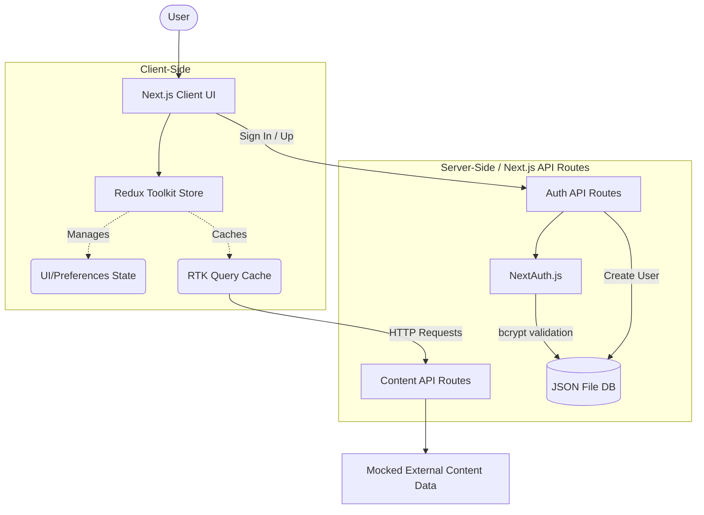

# Personalized Content Dashboard

## 1. Project Overview
The Personalized Content Dashboard is a modern, responsive web application that aggregates content from various sources—such as news, movies, and social media—into a centralized, customizable feed. It solves the problem of information fragmentation by giving users a single hub to consume and curate the content they care about most. Users can interact with the platform by tailoring their feed preferences, dragging and dropping articles to reorganize their view, bookmarking items to read later, and saving favorites. The core purpose is to provide a premium, cinematic reading experience while abstracting away the complexity of tracking multiple disparate content sources.

## 2. Key Features
- **User Registration & Authentication**: Secure signup and login using credentials, protecting user-specific data.
- **Unified & Personalized Feed**: Aggregates news, movies, and social posts into one feed, tailored by user topic preferences (e.g., AI, Gaming, Movies).
- **Smart Recommendations**: Displays a non-intrusive "reason" label (e.g., "Because you follow Technology", "Highly shared") to explain why content appears.
- **Search Capabilities**: Debounced global search bar to quickly filter displayed content across categories.
- **Content Curation**: "Favorites" and "Read Later" sections allow users to save items for future reference, persisting across sessions.
- **"Tune My Feed" Settings**: Deep preference controls letting users toggle specific interests and preferred languages.
- **Drag-and-Drop Organization**: Users can reorder their content cards dynamically using `@dnd-kit`.
- **Resilient UI**: Graceful image fallback handling for broken media links, and polished empty/loading states.
- **Cinematic Dark Mode**: High-contrast, premium aesthetic optimized for readability.
- **Localization**: Basic i18n structure implemented for English and Hindi translations.

## 3. Technology Stack
| Technology | Purpose |
| --- | --- |
| **Next.js (App Router)** | Core React framework providing server-side rendering, routing, and API endpoints. |
| **React** | UI library for building component-driven interfaces. |
| **TypeScript** | Static typing for improved developer experience, code quality, and maintainability. |
| **Redux Toolkit (RTK)** | Global client-state management (UI, Preferences, Favorites, Read Later). |
| **RTK Query** | Powerful data fetching, caching, and state synchronization for content APIs. |
| **NextAuth.js (Auth.js)** | Authentication framework handling session management and secure credential flows. |
| **Tailwind CSS** | Utility-first CSS framework used for responsive, rapid styling and dark mode. |
| **Framer Motion** | Declarative animation library for smooth page transitions and micro-interactions. |
| **dnd-kit** | Lightweight, performant drag-and-drop toolkit for reordering content. |
| **bcryptjs** | Password hashing library for secure credential storage. |
| **Vitest & React Testing Library**| Fast unit and integration testing framework. |
| **Playwright** | End-to-End (E2E) browser testing for critical user flows. |

## 4. Application Architecture

The application follows a clean separation of concerns, heavily leveraging the Next.js App Router for routing/backend APIs and Redux Toolkit for complex client-side state.



- **App Router**: Handles top-level page routes (`/`, `/login`, `/signup`) and API routes (`/api/auth`, `/api/news`, etc.).
- **Redux Store**: Acts as the single source of truth for the client. Slices manage preferences, favorites, read-later lists, and UI state (active tabs, search queries).
- **Authentication**: Managed via NextAuth using a JWT session strategy.
- **Data Flow**: RTK Query hits Next.js API routes, which serve content. Redux state controls what parts of that content are visible or filtered based on user preferences.

## 5. Project Structure

```text
src/
├── app/                  # Next.js App Router pages, layouts, and /api routes
├── components/           # Reusable React components
│   ├── common/           # Generic UI elements (ImageFallback, ThemeToggle)
│   ├── features/         # Domain-specific components (feed, favorites, readLater, settings)
│   └── layout/           # Structural components (Header, Sidebar, Navigation)
├── data/                 # Local filesystem database (users.json)
├── features/             # Redux Toolkit slices (favorites, feed, preferences, readLater, ui)
├── hooks/                # Custom React hooks (useHydrated, useTranslation)
├── lib/                  # Utility functions (constants, personalization, users service, utils)
├── locales/              # i18n translation dictionaries (en, hi)
├── services/             # API layer definitions
│   └── api/              # RTK Query configurations (contentApi.ts)
├── store/                # Redux store configuration (index.ts, hooks.ts)
├── tests/                # Test utilities and global test configurations
└── types/                # TypeScript interface definitions (content.ts)
```

- **`app/`**: Contains the routing logic and backend endpoints.
- **`components/`**: Houses the visual building blocks, strictly separated by domain.
- **`features/`**: Contains pure Redux logic (reducers, selectors) independently from the UI.
- **`services/`**: Abstracts network calls using RTK Query.

## 6. Authentication

The application uses **NextAuth.js** configured with a custom `CredentialsProvider`.

- **Signup Flow**: Users submit their details to `/api/auth/signup`. The server hashes the password with `bcryptjs` and saves the user entity to the local filesystem (`src/data/users.json`).
- **Login Flow**: Users log in via the NextAuth `/login` page. NextAuth cross-references the hashed password against the JSON database.
- **Session Strategy**: Uses stateless JWT tokens (`strategy: 'jwt'`) stored in secure, HTTP-only cookies.
- **Security Guardrails**: Passwords are never returned to the client. The application redirects unauthenticated users away from protected routes.

*Note: The current implementation utilizes a local JSON file (`data/users.json`) as a mock database for demonstration and ease of setup.*

## 7. State Management

**Redux Toolkit (RTK)** orchestrates the application's client state:
- **`uiSlice`**: Tracks the active view (Dashboard, Favorites, Read Later, Settings), the global search query, and sidebar visibility.
- **`preferencesSlice`**: Stores user-selected topics (e.g., AI, Tech) and language.
- **`favoritesSlice` & `readLaterSlice`**: Maintains dictionaries of saved item IDs. These slices use Redux middleware or manual `useEffect` subscriptions to persist data to the browser's `localStorage`.
- **Access Pattern**: Components utilize typed hooks (`useAppSelector`, `useAppDispatch`) to read state and dispatch actions.
- **Asynchronous Data**: Handled entirely by RTK Query rather than manual thunks, ensuring standardized loading and error states.

## 8. Data Fetching and API Layer

- **RTK Query API (`contentApi.ts`)**: Defines endpoints for `getNews`, `getMovies`, and `getSocial`.
- **Next.js API Routes (`app/api/*`)**: Act as backend-for-frontend (BFF) proxies. They currently return statically mocked data but are architected to easily swap out for real external REST APIs.
- **Pagination**: Implemented via an infinite-scroll style merging strategy. RTK Query `merge` functions combine incoming pages of data with the existing cache.
- **Polling Simulation**: The `UnifiedFeed` component runs a local `setInterval` (every 60 seconds) that manually injects simulated real-time social posts into the Redux cache using RTK Query's pessimistic update capabilities.
- **Search**: The search bar locally controls a Redux string which RTK Query uses as an argument (`q`). 

## 9. UI/UX

- **Cinematic Aesthetic**: The UI relies on deep blacks (`#0A0A0A`), sleek borders, and a vibrant red accent (`#E50914`), heavily inspired by modern streaming platforms.
- **Responsive Layout**: Uses a collapsible sidebar on mobile devices and a permanent drawer on desktop displays.
- **Content Cards**: Display rich imagery, source badges, dynamic personalization reasons, and quick-action hover buttons (Heart, Bookmark).
- **Animations**: `framer-motion` applies subtle scale effects on hover, fluid layout shifts, and smooth opacity transitions between the Dashboard, Settings, and Saved views.
- **Empty & Error States**: Robust fallbacks exist for broken images (`<ImageFallback />`) and empty content states (e.g., "No saved articles yet").
- **Accessibility**: Buttons feature `aria-label`s, stateful toggles use `aria-pressed`, and interactive elements possess clear `focus-visible:ring` outlines for keyboard navigation.

## 10. Security

Genuine security implementations present in the codebase:
- **Password Hashing**: User passwords are computationally hashed using `bcryptjs` before storage.
- **Secure Cookies**: NextAuth securely manages session cookies (`__Secure-next-auth.session-token` in production).
- **Security Headers**: `next.config.ts` enforces strict browser protections including `X-Frame-Options: DENY`, `X-Content-Type-Options: nosniff`, `Strict-Transport-Security`, `Referrer-Policy`, and a restrictive `Permissions-Policy`.
- **Environment Variables**: Sensitive keys (like `AUTH_SECRET`) are explicitly isolated to `.env.local` which is strictly `.gitignore`'d.

### Current Limitations / Production Considerations
- **File-Based Database**: The application currently persists user data to `src/data/users.json` using Node's `fs` module. On ephemeral PaaS environments (like Render or Vercel), this filesystem is wiped on every deployment or scale event.
  - *Production Fix*: Before a production launch, the user storage adapter in `src/lib/users.ts` must be migrated to a persistent database (e.g., PostgreSQL, MongoDB, or a managed service like Vercel Postgres).

## 11. Performance Considerations

- **Debounced Search**: User input in the search bar is debounced (400ms) before dispatching to Redux, preventing a flood of re-renders and potential API calls.
- **Component Memoization**: `<ContentCard />` is wrapped in `React.memo` to prevent unnecessary re-renders of the complex feed grid during state updates.
- **RTK Query Caching**: Content API responses are aggressively cached (`keepUnusedDataFor: 300` / 5 minutes), preventing duplicate network requests when navigating between tabs.
- **Optimized Fonts**: Utilizes `next/font` for the Geist font family, preventing layout shifts and optimizing asset loading.

## 12. Testing

The project possesses a robust, multi-layered testing strategy:

- **Unit & Integration Tests (Vitest & React Testing Library)**:
  - `ContentCard.test.tsx`: Validates rendering, localization, and interactivity (favoriting).
  - `UnifiedFeed.test.tsx`: Tests empty states, debounced search filtering, and sortable rendering.
  - Redux Slices: Full coverage of reducers and selectors (`uiSlice`, `preferencesSlice`, `favoritesSlice`, `feedSlice`).
  - *Run command:* `npm run test`
- **End-to-End Tests (Playwright)**:
  - `personalization.spec.ts`: Bootstraps a real browser to verify that "Tune My Feed" settings and "Read Later" bookmarks correctly persist through page reloads.
  - `image-fallback.spec.ts`: Intercepts and blocks image network requests to verify the UI gracefully degrades to the fallback component.
  - *Run command:* `npm run e2e`

## 13. Deployment

The application is prepared for deployment as a standard Node.js Web Service on platforms like Render or Vercel.

**Build Command**:
```bash
npm run build
```

**Start Command**:
```bash
npm start
```

**Required Environment Variables (Production)**:
- `AUTH_SECRET`: A secure, randomly generated 32-character string.
- `AUTH_URL`: (Optional but recommended) The canonical URL of your deployed application.

*Render Deployment Note: To retain user accounts across deployments on Render, you must attach a Persistent Disk to the service or transition the storage layer to an external database.*

## 14. Development Setup

To run the project locally:

```bash
# 1. Install dependencies
npm install

# 2. Setup environment variables
cp .env.example .env.local
# Edit .env.local and add an AUTH_SECRET (e.g., use `openssl rand -base64 32`)

# 3. Start the development server
npm run dev

# 4. (Optional) Run tests
npm run test
npm run e2e
```
